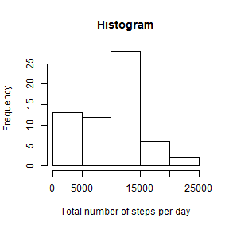

### 1. Introduction

Here we report several findings on a data set obtained from a personal activity monitoring device. In the next few sections the answers to the questions will be fully developed. But first we will load some required packages:


```r
library(knitr)
library(markdown)
```


### 2. Loading the data.
Previously, data was downloaded and placed in a github repository as a compressed file named "activity.zip". First we unzip the file and load the csv formatted data  in a data frame.


```r
unzip("activity.zip")
activity<-read.csv("activity.csv")
```


### 3. What is the total number of steps taken per day?
In this section we used the function tapply to calculate the total number of steps per day and we save it into a variable named "TotalStepsPerDate". In this calculation the "NA" values are ignored.


```r
TotalStepsPerDate<-tapply(activity$steps,activity$date,sum,na.rm=TRUE)
```

Next we can plot a histogram of the calculated variable.


```r
hist(TotalStepsPerDate,xlab="Total number of steps per day", main="Histogram")
```

 

...and finally we report the values of the mean and median values of the total number of steps per day:


```r
print(mean(TotalStepsPerDate))
```

```
## [1] 9354.23
```

```r
print(median(TotalStepsPerDate))
```

```
## [1] 10395
```


### 4. What is the average daily activity pattern?

To answer this question we take a similar approach as before with the function tapply but using the 5 minute intervals as a grouping variable. The quantity of5 min intervals in a day is 288 and these are the new groups. Therefore we calculate the mean values on each interval averaged across all days.


```r
avePerInterval<-tapply(activity$steps,activity$interval,mean,na.rm=TRUE)
```

The final results are now ploted as a time series:


```r
plot(1:length(unique(activity$interval)),avePerInterval,type="l",xlab="5 min intervals (per day)",ylab="Mean number of steps", main="Time series (Steps/Interval)")
```

 

Now we obtain the index where the mean number of steps is maximum which is:


```r
indexM<-which.max(as.vector(avePerInterval))
print(indexM)
```

```
## [1] 104
```

and the corresponding 5 min interval is:


```r
ss<-as.vector(unique(activity$interval))
minuteMax<-ss[indexM]
print(minuteMax)
```

```
## [1] 835
```


### 5. Imputing missing values.
In this data set, 'NA' values are only present in the variable 'steps'. Therefore we can calculate the total number of 'NA' values simply as:


```r
print(sum(is.na(activity$steps)))
```

```
## [1] 2304
```


Now we create code to substitute the missing 'NA' values by the mean values of the same interval averaged across all dates calculated by ignoring the missing values in the other days.


```r
activity2<-activity
tmp<-unique(activity$interval)
for (i in 1:length(activity$steps)){
        if(is.na(activity$steps[i])==TRUE){
                PP<-activity$interval[i]
                indexP<-match(PP,tmp)
                activity2$steps[i]<-avePerInterval[indexP]
        }
}
print(sum(is.na(activity2$steps)))
```

```
## [1] 0
```

As the sum of TRUE values for the is.na() function is zero then we can be sure that we substitute all the 'NA' values on the selected variable 

Now we can see the first values of the original and the modified dataframes to confirm that the 'NA' values were substituted:

Original:

```r
head(activity,3)
```

```
##   steps       date interval
## 1    NA 2012-10-01        0
## 2    NA 2012-10-01        5
## 3    NA 2012-10-01       10
```


Modified:

```r
head(activity2,3)
```

```
##       steps       date interval
## 1 1.7169811 2012-10-01        0
## 2 0.3396226 2012-10-01        5
## 3 0.1320755 2012-10-01       10
```

Now we plot the histograms of the number of steps in the original and the midified ('NA' values filled with mean values per interval).


```r
TotalStepsPerDate2<-tapply(activity2$steps,activity2$date,sum)
par(mfrow=c(1,2))
hist(TotalStepsPerDate,main="Original",xlab="steps")
hist(TotalStepsPerDate2,main="Modified",xlab="steps")
```

 

Now we can estimate the total number of steps for the new data frame, as well as the new mean and median values

for the Original data frame


```r
print(mean(TotalStepsPerDate))
```

```
## [1] 9354.23
```

```r
print(median(TotalStepsPerDate))
```

```
## [1] 10395
```

For the modified data frame:


```r
print(mean(TotalStepsPerDate2))
```

```
## [1] 10766.19
```

```r
print(median(TotalStepsPerDate2))
```

```
## [1] 10766.19
```

The histograms show us great variations between the original and the modified data sets. Besides, the mean and median values were indeed affected; in the last data set we even see that the mean and median values now coincide.

### 6. Are there differences in activity patterns between weekdays and weekends?

To explore this posibility we first create a vector in which we take the values in the variable 'date' and converted to weekdays (e.g., "Monday", etc.)
Subsequently we add this variable as a new columns to our data set.


```r
wd=list()
for (i in 1:length(activity2$date)){
        wd<-c(wd,weekdays(as.Date(as.character(activity2$date[i]))))        
}
wd<-as.matrix(wd)
activity3<-cbind(activity2,wd)
```

Now we visualize the begining of this new data frame.


```r
head(activity3,3)
```

```
##       steps       date interval     wd
## 1 1.7169811 2012-10-01        0 Monday
## 2 0.3396226 2012-10-01        5 Monday
## 3 0.1320755 2012-10-01       10 Monday
```

At this point we create a new boolean variable that is TRUE for weekends and add the new variable as another column.


```r
weekend<-(activity3$wd=="Saturday" | activity3$wd=="Sunday")
activity3<-cbind(activity3,weekend)
head(activity3,3)
```

```
##       steps       date interval     wd weekend
## 1 1.7169811 2012-10-01        0 Monday   FALSE
## 2 0.3396226 2012-10-01        5 Monday   FALSE
## 3 0.1320755 2012-10-01       10 Monday   FALSE
```

At this point we can subset the data frame in two new data frames based on the boolean variable 'weekend' and on each table we calculate the mean number of steps per interval:


```r
tab1<-subset(activity3,activity3$weekend==TRUE)
tab2<-subset(activity3,activity3$weekend==FALSE)
ave1<-tapply(tab1$steps,tab1$interval,mean)
ave2<-tapply(tab2$steps,tab2$interval,mean)
```


The final results are now ploted as a two time series:


```r
par(mfrow=c(2,1))
plot(1:length(unique(tab1$interval)),ave1,type="l",xlab="5 min intervals (per day)",ylab="Mean number of steps", main="Time series (Weekend)")
plot(1:length(unique(tab1$interval)),ave2,type="l",xlab="5 min intervals (per day)",ylab="Mean number of steps", main="Time series (Weekdays)")
```

 


